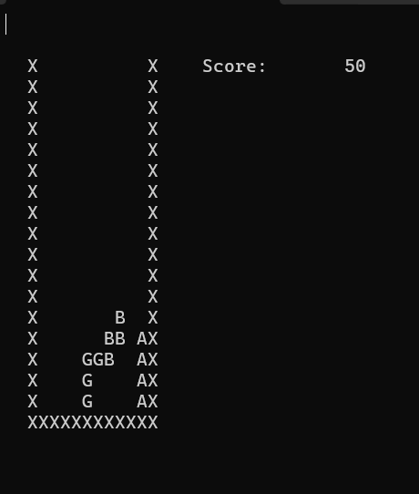

# Console Based Tetris

Console based implementation of the popular game tetris using C++.


## Badges

[](https://opensource.org/licenses/)


## Acknowledgements

 - [Javidx9's Youtube channel](https://www.youtube.com/@javidx9)
 - [Javidx9's Github repo](https://github.com/OneLoneCoder/Javidx9/tree/c9ca5d2e5821f2d2e07f07f388803c185a68d13a/SimplyCode)
 


## Authors

- [@usmanawan50](https://github.com/usmanawan50/usmanawan50.git)


## Deployment(on Windows) 

To deploy this project download source.cpp, open windows command line and move to the directory where the file is present. Then run command according to your compiler:

### MingW
```bash
  g++ source.cpp -o output.exe; ./output.exe
```

### Clang++
```bash
  clang++ -std=c++17 -Wall -Wextra -o output source.cpp && ./output
```


## FAQ

#### Controls:

Arrow keys for: left, right, down.<br>
Z: change orientation

#### Why my console screen looks wonky?

The application was built using Microsoft Visual Studio. You can adjust the screen parameters for your console screen from the code.


## Usage/Examples


<br>(Microsoft Visual Studio)


